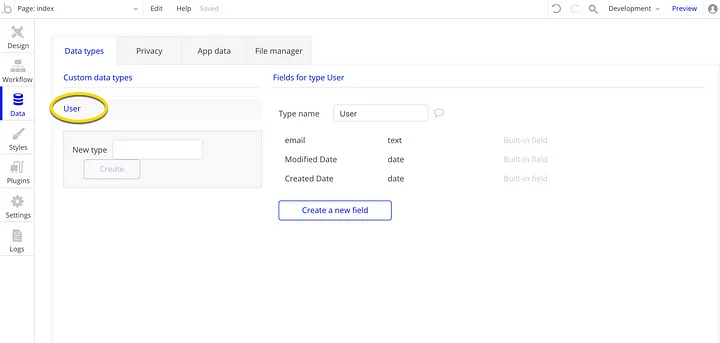
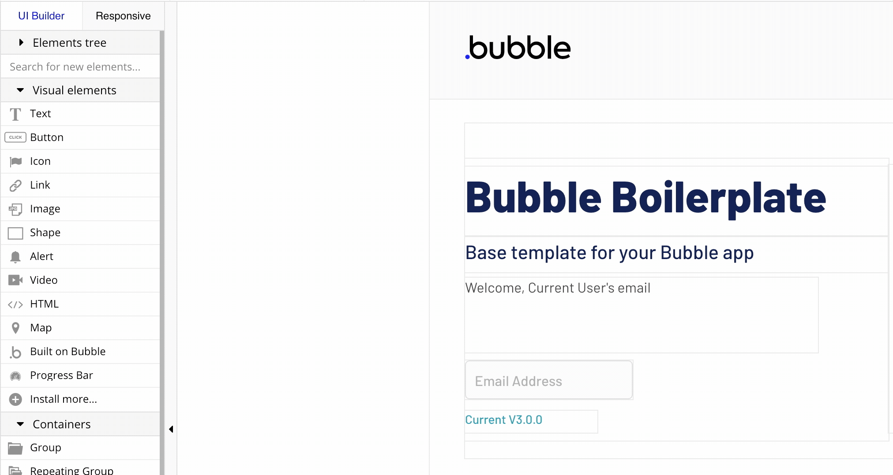
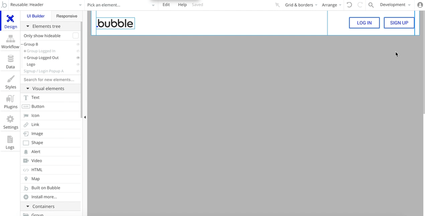
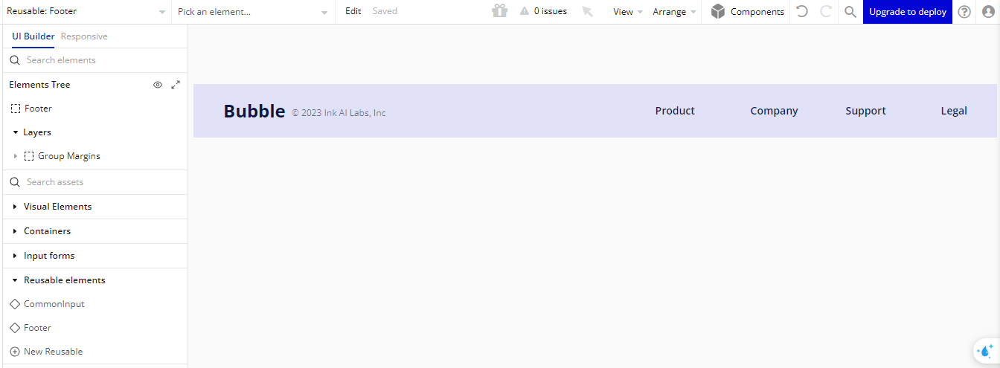
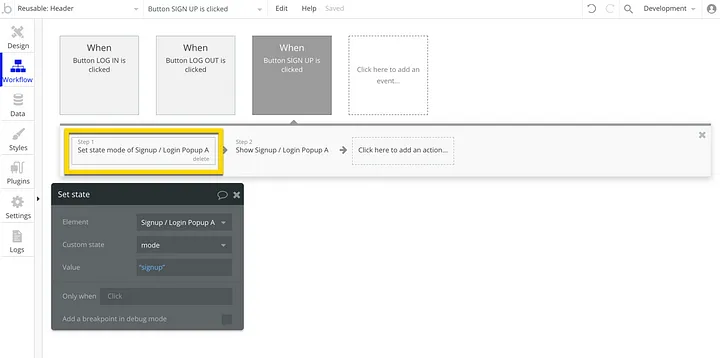
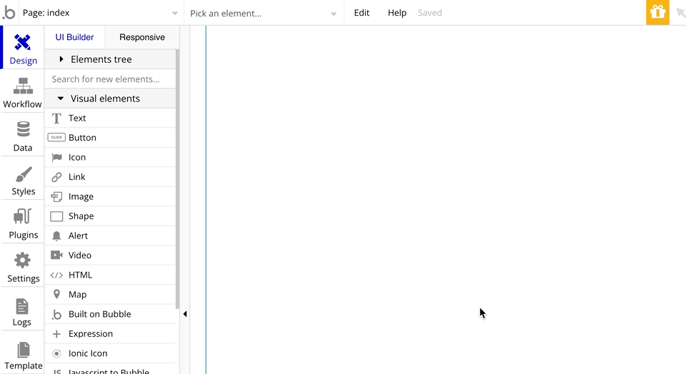
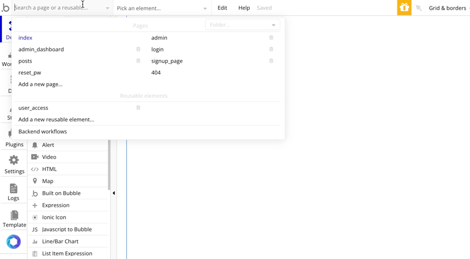
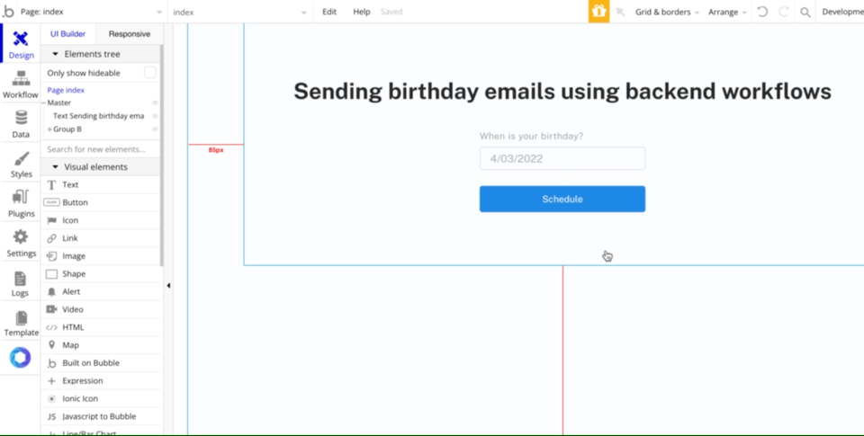

# **Complete Bubble Developer Course: Build Apps Without Coding**

## 🔷 MỤC LỤC

- **[Tổng quan về Bubble](#tổng-quan-về-bubble)**
- **[Cơ sở dữ liệu](#cơ-sở-dữ-liệu)**
- **[Giao diện và thiết kế](#giao-diện-và-thiết-kế)**
- **[Workflows](#workflows)**
- **[Plugin](#plugin)**
- **[Styles](#styles)**
- **[Logs](#logs)**

## 🔷Tổng quan về Bubble

### Khái niệm

- **Bubble** là nền tảng NoCode dùng để xây dựng web app mạnh mẽ nhất hiện nay.

Được gọi là Visual Programming Tool (công cụ lập trình trực quan), bạn có thể tạo UI bằng cách kéo thả, setting chi tiết cho từng UI cũng như cách hoạt động của các thành phần, ngoài ra bạn cũng có thể thiết kế database một cách chặt chẽ, từ đó có thể tạo được rất nhiều web service khác nhau.

### Why Bubble?

- **Không cần mã lập trình**: Bubble platform sử dụng nguyên tắc kéo và thả để xây dựng ứng dụng mà không cần viết mã lập trình. Điều này giúp người dùng không cần có kiến thức chuyên sâu về lập trình vẫn có thể tạo ra ứng dụng web chất lượng cao.

- **Tốc độ phát triển nhanh chóng**: Với công cụ kéo và thả trực quan, người dùng có thể nhanh chóng thiết kế giao diện và logic của ứng dụng mà không cần mất nhiều thời gian.

- **Hỗ trợ đa nền tảng**: Bubble platform cho phép người dùng xây dựng ứng dụng web có thể tương thích trên nhiều thiết bị và trình duyệt khác nhau mà không cần phải lo lắng về việc tối ưu hóa giao diện.

- **Mạnh mẽ và linh hoạt**: Bubble cung cấp nhiều tính năng mạnh mẽ như xử lý dữ liệu, tích hợp API, tự động cập nhật dữ liệu và nhiều tính năng khác giúp người dùng xây dựng ứng dụng web đa dạng theo nhu cầu.

- **Cộng đồng hỗ trợ lớn**: Bubble có một cộng đồng người dùng rộng lớn, cùng với tài liệu hướng dẫn phong phú giúp người mới bắt đầu dễ dàng học hỏi và giải quyết vấn đề trong quá trình phát triển ứng dụng.

## 🔷Cơ sở dữ liệu

Bubble sử dụng cơ sở dữ liệu nhúng. Nó kém mạnh mẽ hơn cơ sở dữ liệu SQL của bên thứ ba nhưng cho phép làm việc nhanh chóng.

### Data Types

Cơ sở dữ liệu trong Bubble hoạt động dựa trên **Data Types**, tương đương với các bảng trong cơ sở dữ liệu quan hệ. Mỗi **Data Types** đại diện cho một loại đối tượng mà bạn muốn lưu trữ dữ liệu.

Trong ứng dụng của bạn sẽ luôn có sẵn Data Types `User` - dùng để lưu trữ tất cả những người dùng đăng ký ứng dụng của bạn. Hầu hết các ứng dụng web đều có chức năng đăng ký/đăng nhập vào ứng dụng, nên kiểu dữ liệu `User`được tích hợp sẵn trong tất cả ứng dụng Bubble và không thể xóa.

  

    
  

### Data Fields

Đối với mỗi `Data Types`, bạn có thể định nghĩa các trường tùy chỉnh. Các trường này được gọi là **Data Fields**. Để thêm một **Data Fields**, bạn cần nhập tên và chỉ định kiểu dữ liệu của trường đó.

  

    
  

Kiểu dữ liệu `User` có 3 trường tich hợp sẵn:

- `email`: email mà người này sử dụng để đăng ký tài khoản
- `Modified Date`: ngày người này thực hiện thay đổi cuối cùng cho tài khoản của họ
- `Created Date`: ngày người này đăng ký ứng dụng

Khi bạn xây dựng ứng dụng, bạn có thể thêm nhiều trường hơn để lưu trữ thông tin khác về `User` (ví dụ: "tên", "họ", "ảnh đại diện", "địa chỉ" và nhiều thông tin khác) và tạo các kiểu dữ liệu khác để lưu trữ thông tin khác.

(Lưu ý: **Mật khẩu** cũng được tích hợp sẵn trong mọi ứng dụng Bubble và được Bubble lưu trữ + mã hóa an toàn. Mật khẩu không bao giờ được hiển thị ở bất kỳ đâu trong trình chỉnh sửa ứng dụng.)

### App Data

Khi bạn đã tạo các loại dữ liệu cần thiết, tất cả chúng có thể được tìm thấy trong tab **App Data**, nơi chúng được trình bày dưới dạng bảng. Bạn cũng có thể thêm mới, chỉnh sửa, xóa, export, import dữ liệu ở đó.

  

    
  

### Option Sets

**Option Sets** là một cách để lưu trữ các tùy chọn (options) hoặc danh sách các mục không thay đổi (static items) mà bạn muốn sử dụng trong ứng dụng của mình. **Option Sets** giúp bạn quản lý các giá trị cố định một cách dễ dàng và tái sử dụng chúng trong nhiều nơi trong ứng dụng.

  

    
  

### Relationship

Khái niệm **relationship** (mối quan hệ) thường được sử dụng để liên kết giữa các bảng dữ liệu (Data Types) khác nhau trong cơ sở dữ liệu của ứng dụng. Bubble không sử dụng các mối quan hệ cơ sở dữ liệu tiêu chuẩn. Chúng được cấu hình thông qua các loại. Trong Bubble, có một số loại mối quan hệ chính:

- **One to One Relationship (1-1)**: Một phần tử của bảng này chỉ được liên kết với duy nhất một phần tử của bảng khác.
- **One to Many Relationship (1-N)**: Một phần tử của bảng này có thể được liên kết với nhiều phần tử của bảng khác.
- **Many to Many Relationship (N-N)**: Mỗi phần tử trong mỗi bảng có thể được liên kết với nhiều phần tử trong bảng còn lại.

### Phân quyền

Bubble cung cấp cơ chế bảo vệ dữ liệu thông qua "Data Privacy Rules" để kiểm soát việc truy cập dữ liệu trong ứng dụng.

Trong phần Data Privacy Rules, bạn có thể thiết lập các quy tắc bảo vệ dữ liệu theo yêu cầu của ứng dụng:

- **Define Rules**: Bạn có thể xác định các quy tắc riêng biệt cho từng loại dữ liệu (Data Type). Ví dụ, bạn có thể thiết lập quy tắc chỉ cho phép người dùng xem thông tin của chính họ.
- **Allow/Block**: Bubble cho phép bạn quyết định ai được phép truy cập, chỉnh sửa hoặc xóa dữ liệu trong cơ sở dữ liệu.
- **Constraints**: Bạn có thể áp dụng ràng buộc để kiểm tra điều kiện trước khi cho phép truy cập dữ liệu. Ví dụ, chỉ hiển thị dữ liệu của người dùng nào đang đăng nhập.

## 🔷Giao diện và thiết kế

Trong Bubble, mục **Design** cho phép bạn tùy chỉnh giao diện người dùng (UI) của ứng dụng web mà bạn đang phát triển một cách linh hoạt và dễ dàng. Từ việc thiết kế giao diện đến xử lý sự tương tác của người dùng, mục Design cung cấp các công cụ và tính năng để bạn tạo ra trải nghiệm người dùng tốt nhất có thể.

  

### Drag-and-Drop Editor

Bubble cung cấp trình chỉnh sửa giao diện kéo và thả (drag-and-drop), giúp bạn dễ dàng tạo và sắp xếp các phần tử trên trang web mà không cần viết mã lập trình.
Bạn có thể kéo các phần tử như nút, ô văn bản, hình ảnh, biểu mẫu, v.v., và thả chúng vào vị trí mong muốn trên trang.

  

### Responsive Design

Với Bubble, bạn có thể tạo giao diện phản ứng (responsive design) dễ dàng, giúp ứng dụng của bạn hiển thị tốt trên các thiết bị khác nhau từ máy tính đến điện thoại di động.
Bạn có thể tùy chỉnh cách hiển thị của phần tử trên các kích thước màn hình khác nhau để đảm bảo trải nghiệm người dùng đồng nhất.

### Interactions

Bạn có thể thiết lập tương tác giữa các phần tử trên trang bằng cách sử dụng công cụ **Workflows** trong Bubble.
Ví dụ, bạn có thể thiết lập hành động khi người dùng nhấp vào một nút, hoặc hiển thị thông báo khi người dùng điền vào một biểu mẫu.

  

### Reusable Elements

Bubble cho phép bạn tạo các phần tử giao diện (elements) có thể tái sử dụng trên nhiều trang khác nhau trong ứng dụng của mình.
Điều này giúp tăng hiệu quả trong quản lý giao diện và duy trì tính nhất quán giữa các trang.

  

## 🔷Workflows

### Workflow trong ứng dụng website

Bubble Workflows được sử dụng để xác định những gì xảy ra khi người dùng tương tác với ứng dụng của bạn (ví dụ: lưu thông tin mà Người dùng vừa nhập, lưu tùy chọn của Người dùng, lưu thông tin về Người dùng, hiển thị cửa sổ bật lên, hiển thị cảnh báo, gửi email, kết nối với API bên ngoài, v.v.).

  

Mỗi workflows bao gồm hai phần: **1 event** và **1 hoặc nhiều actions**

**Event** là một phần của workflow giúp Bubble thông báo khi nào nên thực hiện **actions**. Khi một **event** là đúng, Bubble sẽ thực hiện các **actions** của event đó. Nói cách khác, workflow tương tự như các câu lệnh `If then`

Ví dụ:
<i>“When the Button SIGN UP is clicked”</i> (tức là khi Người dùng nhấp vào nút SIGN UP) →

  

    
  

<i>“Chạy”</i> hai actions sau:

  

    
  

### Backend workflows

Backend Workflows là **server-side** workflows, tức là các workflows này chỉ chạy phía máy chủ mà không chạy trên trình duyệt của người dùng.

Các trường hợp sử dụng **Backend workflows**

1. "Lên lịch" một số hành động trong tương lai. Ví dụ: tính phí người dùng sau một tháng dùng thử, gửi lời nhắc một tuần trước sự kiện,...
2. Lặp lại trên một danh sách. Ví dụ: tặng coin và gửi thông báo cho tất cả người dùng,...
3. Tái sử dụng backend workflow nhiều lần ở nhiều workflows khác nhau.
4. Viết workflow API.

Lưu ý: Tính năng này chỉ được sử dụng trên các gói trả phí của Bubble.

Để bật tính năng này, vào Settings > API > Enable Workflow API and backend workflows

  

    
  

Ví dụ: Gửi email chúc mừng sinh nhật đến người dùng
<u>Bước 1:</u> Tạo backend workflow gửi mail

  

    
  

<u>Bước 2:</u> Kích hoạt backend workflow đã viết

  

    
  

## 🔷Plugin

Ngoài việc sử dụng các tính năng mặc định của Bubble, bạn có thể cài thêm plugin hoặc tự viết để mở rộng tính năng của app.

Ví dụ bạn làm tính năng Analytics thì có thể cài thêm plugin `chart.js`, làm thanh toán có thể cài thêm `Stripe` hoặc `Paypal`

Có plugin của Bubble giúp bạn connect với API hoặc với 1 app Bubble khác

## 🔷Styles

### Custom Styles

Bubble cho phép bạn tùy chỉnh các phong cách (styles) cho các phần tử trên trang, bao gồm màu sắc, font chữ, kích thước, v.v.
Bạn có thể định nghĩa các kiểu CSS tùy chỉnh hoặc sử dụng các kiểu mẫu được cung cấp sẵn để áp dụng cho các phần tử trên trang web.
