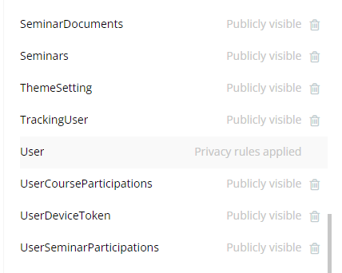
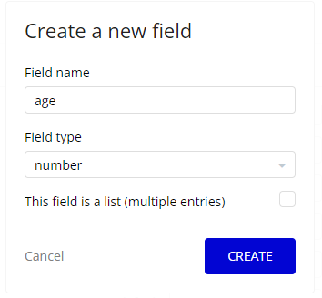
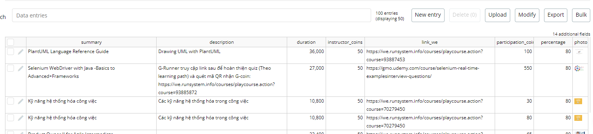
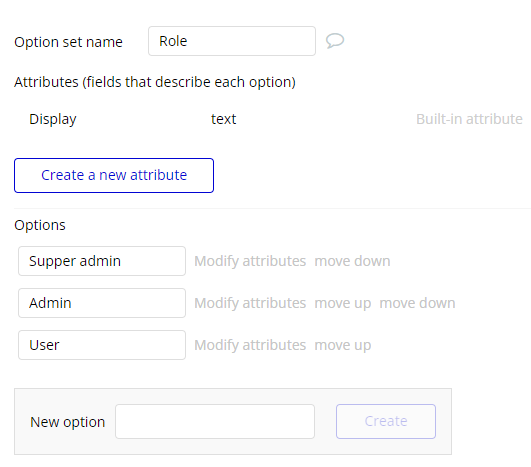

# **Complete Bubble Developer Course: Build Apps Without Coding**

## 🔷 MỤC LỤC

- **[Tổng quan về Bubble](#tổng-quan-về-bubble)**
- **[Cơ sở dữ liệu](#cơ-sở-dữ-liệu)**
- **[Giao diện xây dựng website](#giao-diện-xây-dựng-website)**
- **[Workflow](#workflow)**
- **[Plugin](#plugin)**
- **[Styles](#styles)**
- **[Logs](#logs)**

## 🔷Tổng quan về Bubble

### Khái niệm

- **Bubble** là nền tảng NoCode dùng để xây dựng web app mạnh mẽ nhất hiện nay.

Được gọi là Visual Programming Tool (công cụ lập trình trực quan), bạn có thể tạo UI bằng cách kéo thả, setting chi tiết cho từng UI cũng như cách hoạt động của các thành phần, ngoài ra bạn cũng có thể thiết kế database một cách chặt chẽ, từ đó có thể tạo được rất nhiều web service khác nhau.

### Why Bubble?

- **Không cần mã lập trình**: Bubble platform sử dụng nguyên tắc kéo và thả để xây dựng ứng dụng mà không cần viết mã lập trình. Điều này giúp người dùng không cần có kiến thức chuyên sâu về lập trình vẫn có thể tạo ra ứng dụng web chất lượng cao.

- **Tốc độ phát triển nhanh chóng**: Với công cụ kéo và thả trực quan, người dùng có thể nhanh chóng thiết kế giao diện và logic của ứng dụng mà không cần mất nhiều thời gian.

- **Hỗ trợ đa nền tảng**: Bubble platform cho phép người dùng xây dựng ứng dụng web có thể tương thích trên nhiều thiết bị và trình duyệt khác nhau mà không cần phải lo lắng về việc tối ưu hóa giao diện.

- **Mạnh mẽ và linh hoạt**: Bubble cung cấp nhiều tính năng mạnh mẽ như xử lý dữ liệu, tích hợp API, tự động cập nhật dữ liệu và nhiều tính năng khác giúp người dùng xây dựng ứng dụng web đa dạng theo nhu cầu.

- **Cộng đồng hỗ trợ lớn**: Bubble có một cộng đồng người dùng rộng lớn, cùng với tài liệu hướng dẫn phong phú giúp người mới bắt đầu dễ dàng học hỏi và giải quyết vấn đề trong quá trình phát triển ứng dụng.

## 🔷Cơ sở dữ liệu

Bubble sử dụng cơ sở dữ liệu nhúng. Nó kém mạnh mẽ hơn cơ sở dữ liệu SQL của bên thứ ba nhưng cho phép làm việc nhanh chóng.

- **Data Types**
  Cơ sở dữ liệu trong Bubble hoạt động dựa trên "Data Types", tương đương với các bảng trong cơ sở dữ liệu quan hệ. Mỗi "Data Types" đại diện cho một loại đối tượng mà bạn muốn lưu trữ dữ liệu.
  

    
  

- **Data Fields**
  Đối với mỗi "Data Types", bạn có thể định nghĩa các trường tùy chỉnh. Các trường này được gọi là "Data Fields". Để thêm một "Data Fields", bạn cần nhập tên và chỉ định kiểu dữ liệu của trường đó.
  

    
  

- **App Data**
  Khi bạn đã tạo các loại dữ liệu cần thiết, tất cả chúng có thể được tìm thấy trong tab "App Data", nơi chúng được trình bày dưới dạng bảng. Bạn cũng có thể thêm mới, chỉnh sửa, xóa, export, import dữ liệu ở đó.
  

    
  

- **Option Sets**
  Option Sets là một cách để lưu trữ các tùy chọn (options) hoặc danh sách các mục không thay đổi (static items) mà bạn muốn sử dụng trong ứng dụng của mình. Option Sets giúp bạn quản lý các giá trị cố định một cách dễ dàng và tái sử dụng chúng trong nhiều nơi trong ứng dụng.
  

    
  

- **Relationship**
  Khái niệm "relationship" (mối quan hệ) thường được sử dụng để liên kết giữa các bảng dữ liệu (Data Types) khác nhau trong cơ sở dữ liệu của ứng dụng. Bubble không sử dụng các mối quan hệ cơ sở dữ liệu tiêu chuẩn. Chúng được cấu hình thông qua các loại. Trong Bubble, có một số loại mối quan hệ chính:

  - `One to One Relationship (1-1)`: Một phần tử của bảng này chỉ được liên kết với duy nhất một phần tử của bảng khác.
  - `One to Many Relationship (1-N)`: Một phần tử của bảng này có thể được liên kết với nhiều phần tử của bảng khác.
  - `Many to Many Relationship (N-N)`: Mỗi phần tử trong mỗi bảng có thể được liên kết với nhiều phần tử trong bảng còn lại.

- **Phân quyền**
  Bubble cung cấp cơ chế bảo vệ dữ liệu thông qua "Data Privacy Rules" để kiểm soát việc truy cập dữ liệu trong ứng dụng.

  Trong phần Data Privacy Rules, bạn có thể thiết lập các quy tắc bảo vệ dữ liệu theo yêu cầu của ứng dụng:

  - `Define Rules`: Bạn có thể xác định các quy tắc riêng biệt cho từng loại dữ liệu (Data Type). Ví dụ, bạn có thể thiết lập quy tắc chỉ cho phép người dùng xem thông tin của chính họ.
  - `Allow/Block`: Bubble cho phép bạn quyết định ai được phép truy cập, chỉnh sửa hoặc xóa dữ liệu trong cơ sở dữ liệu.
  - `Constraints`: Bạn có thể áp dụng ràng buộc để kiểm tra điều kiện trước khi cho phép truy cập dữ liệu. Ví dụ, chỉ hiển thị dữ liệu của người dùng nào đang đăng nhập.
